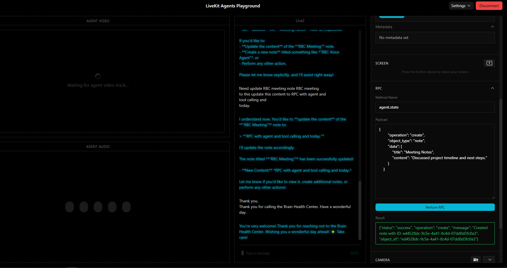

# 🎙️ LiveKit Voice Agent Mastery

Welcome to the **LiveKit Voice Agent Mastery** repository! This project serves as a comprehensive, step-by-step guide and template for building advanced, production-ready Voice AI Agents using the [LiveKit Agents Framework](https://docs.livekit.io/agents/).

Whether you are building a simple receptionist, a complex multi-agent handoff system, or integrating custom TTS plugins, you will find working examples and best practices here.

---

## 📂 Repository Structure

The repository is logically structured to take you from basic concepts to advanced voice AI architectures:

### `01_basics/`
Core concepts and session setup.
- **`basic_agent.py`**: A minimal working voice agent.
- **`prewarming_agent.py`**: How to use prewarming for zero-latency cold starts.
- **`session_configuration.py`**: Advanced configuration (turn detection, interruptions).
- **`session_events.py` / `advanced_session_events.py`**: Listening and reacting to user/agent state changes.

### `02_tasks_and_workflows/`
Advanced control flow and forcing the AI to collect specific information.
- **`1_simple_task.py`**: Basic single-goal task (e.g., getting consent).
- **`2_complex_task.py`**: Multi-step data collection (Name, Email, Phone).
- **`3_unordered_task.py`**: Collecting information where the user can answer in any order.
- **`4_task_groups.py`**: Executing multiple tasks sequentially using `TaskGroup`.

### `03_routing_and_handoffs/`
Multi-agent architectures.
- **`agent_handoffs.py`**: AI-driven seamless transfer of a call from an Intake Agent -> Specialist -> Legal Agent.
- **`token_dispatching.py`**: Forcing a specific agent to handle a specific room via LiveKit Tokens.

### `04_rpc_communication/`



Real-time Frontend Integration.
- **`rpc_from_frontend.py`**: Handling Remote Procedure Calls (RPC) triggered by the user's UI.
- **`rpc_to_frontend.py`**: The agent sending RPC to the frontend (e.g., asking the user to click "Confirm" on their screen).
- **`mock_ui_client.py`**: A python script simulating a frontend client to test RPCs.

### `05_custom_plugins/`
Bring your own AI models!
- **`custom_xtts_plugin/`**: Example of wrapping a custom XTTS API into a native LiveKit TTS Plugin.
- **`use_custom_tts_agent.py`**: Applying the custom plugin in an active session.

---

## 🚀 Getting Started

### 1. Prerequisites
- **Python 3.12+**
- **[uv](https://github.com/astral-sh/uv)** package manager (highly recommended for speed).
- A [LiveKit Cloud](https://cloud.livekit.io/) account (or a local LiveKit server).
- API Keys for your AI providers (OpenAI, Deepgram, Cartesia, etc.).

### 2. Installation
Clone the repository and install dependencies:
```bash
git clone https://github.com/ahmedAEAID/livekit-voice-agent-mastery.git
cd livekit-voice-agent-mastery
uv sync
```

### 3\. Environment Variables

Copy the example environment file and fill in your actual credentials:

```bash
cp .env.example .env.local
```

*(Never commit your `.env.local` file\!)*

### 4\. Running an Agent

You can run any script in development mode. For example, to run the basic agent:

```bash
uv run 01_basics/basic_agent.py dev
```

-----

## 📖 Documentation & Guides

Check the `/docs` folder for deeper architectural guides:

  - [Deployment & Configuration Guide](docs/deployment_guide.md)
  - [Agent Dispatching & Prompting Behavior](docs/day2_dispatching_and_behavior.md)

-----

## 🤝 Contributing

Contributions, issues, and feature requests are welcome\! Feel free to open an issue or submit a Pull Request if you have ideas to improve these examples.

-----

*Built with ❤️ using the LiveKit Framework.*
